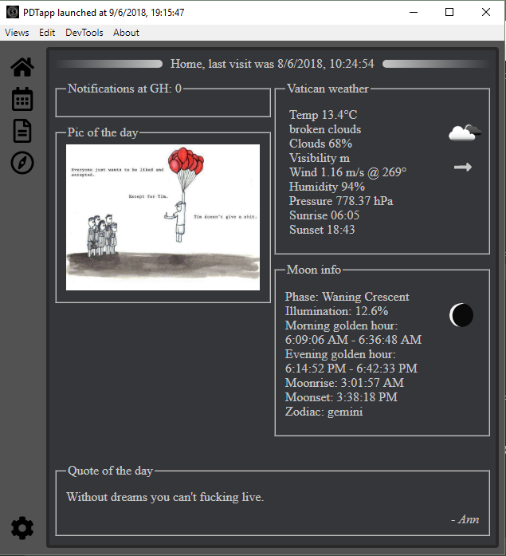

## PDTapp personal desktop app 2.x.x

PDTapp is a 'little' *sideventure*tm to learn & build a little personal desktop app with electron.
I have no idea what the end product will be like. I'm making this shit up as I go along & modifying/changing things as I see fit.  

### dependencies so far
* react
* ~~fullcalendar, react-big-calendar~~ fullcalendar
* react-datepicker
* electron-store
* dotenv
* showdown
* ~~cheerio~~
* [futility](https://github.com/Fraasi/futility)
* xterm + node-pty
* systeminformation

### todo (or maybe not to, do):

* [x] **Startpage**
  - [x] ~~weather & moon info~~, removed because I built [Saeae](https://github.com/Fraasi/Saeae)
  - [x] make random quote api in heroku & fetch a quote
  - [x] random image from a folder
  - [x] github notifications
- [x] **Nav bar**
  - [x] hotkeys for views
- [x] **Calendar** 
  - [x] week month tooltip full text
  - [x] monthview recurring shit
  - [ ] add google calendar support (if possible?)
- [x] **Compass page**
  - [x] removed because I built [tapahtumat](https://pispala.events), now uses it in Iframe
- [x] **Notebook page**
  - [x] markdown support
  - [x] put to store to keep notes between launches
  - [ ] maybe also use firestore?
  - [x] hotkeys for save, delete & views
  - [x] add example note with info on first launch
- [x] **Settings page**
  - [x] choose pic of the day folder
  - [x] clear settings file button
  - [x] select which view opens when launched
- [x] **Terminal page**
  - [ ] Quick links
  - [x] terminal emulator
  - [ ] keep session open while checking other views
- [x] **Stats page**
  - [x] display stats from systeminformation
- [x] **Main.js + other**
  - [x] icon
  - [x] system tray
  - [x] taskbar right click icon. No icon but app name is correct after build
  - [x] menu
  - [x] settings file
  - [x] loader/spinner
  - [x] notification script
  - [x] (esLint, airBnB) => new Promise().resolve(hell)  
  - [x] global shortcut to copy clipboard to a note
  - [ ] Error alert, use notification?

#### Screenshot of the early home page    

<!-- Cool little app you've got there, the design is kinda boring I would've changed fonts, colors and try to setup a structored way to display data, removed the borders and made background colors instead, removed the top "Home" and putting the date at the bottom since it should not be the key focus. -->
