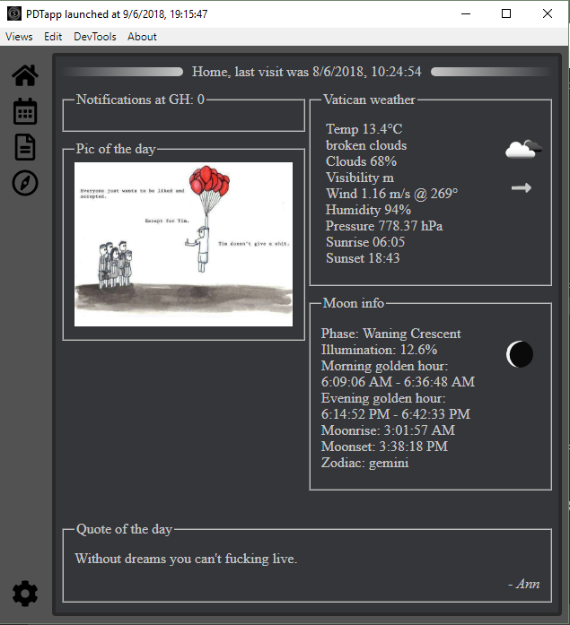

## PDTapp personal desktop app 1.0.0

PDTapp is a 'little' *sideventure*<sup>tm</sup> to learn & build a little personal desktop app with electron.
I have no idea what the end product will be like. I'm making this shit up as I go along.  

### dependencies so far
* react
* fullcalendar.js
* node-osmosis
* electron-store
* dotenv
* showdown
* suncalc

### todo (or maybe not to, do):

* [x] **Startpage**
  - [x] weather
  - [x] make random quote api in heroku & fetch a quote
  - [x] random image
  - [x] github notifications
  - [x] mooninfo
 - [x] **Nav bar**
  - [x] hotkeys for views
- [x] **Calendar** 
  - [x] week month tooltip full text
  - [x] monthview recurring shit
  - [x] fit height fix
  - [ ] listview, events coming month with diff color
- [x] **Gigs page**
  - [x] styling
  - [x] promises promises...
  - [x] put gigs in app state so need only load once  
- [x] **Notebook page**
  - [x] markdown support
  - [x] put to store to keep notes between launches 
  - [x] hotkeys for save & views
  - [x] add example note with info on first launch
- [x] **Settings page**
  - [x] choose pic of the day folder
  - [x] choose weather city
  - [x] clear settings file button
- [x] **Main.js + other**
  - [x] icon
  - [x] system tray
  - [x] taskbar right click icon. No icon but app name is correct after build
  - [x] menu
  - [x] settings file
  - [x] loader/spinner
  - [x] notification script  (propably waste of time)
  - [x] (esLint, airBnB) => new Promise().resolve(hell)  

#### Screenshot of the home page so far  


### Note!
If you want to try this, just clone the repo and do `npm install`,  
but you need to make .env file at the root and put these inside
```
GIT_OAUTH_TOKEN=<your github token>
OPENWEATHER_APIKEY=<your openweather api key>
```
to make the weather and github notifications work.
After that just `npm start`.
If you want to have stuff in the calendar, you need to make calendar-data.js file in src\assets\ folder and read about fullcalendar.js.  
Example:
```
exports.calendarData = [
	{
		title: 'title',
	 	start: '11:00',
	 	end: '13:00',
	 	dow: [1, 2, 3, 4, 5],
		className: 'weekly'
	}
]
```